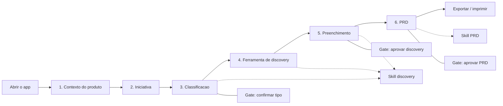

# Jornada do usuario — PM Builder (fluxo de uso hoje)

Registro do fluxo **como o produto funciona hoje**, na branch
`cursor/pm-builder-prd-mvp-ac32`. Fonte: a interface em `src/`, as regras de
avanco em `src/services/validation.js` e o estado em `src/state/`.

Persona principal: **Product Manager**. Nao ha login, papéis nem colaboração em
tempo real. Uma jornada por navegador, persistida em `localStorage`.

O fluxo termina na **aprovacao do PRD**. Design doc, tarefas, PRs e integracoes
nativas (Miro, Docs, BusinessMap) ficam fora desta versao.

---

## Visao da jornada

Fases: **Setup** (1) → **Upstream** (2–3) → **Discovery** (4–5) → **Entrega** (6).
Linha continua e a jornada do PM. Linha tracejada e chamada de skill.

A timeline na pagina mostra as seis etapas de uma vez. Etapas futuras ficam
fechadas ate serem reveladas; etapas anteriores podem ser reabertas pelo
cabecalho do cartao.

Cabecalho fixo: voltar uma etapa, reiniciar a jornada (com confirmacao).

---

## Papel da IA no fluxo

Duas skills, sempre como **sugestao**. O PM confirma ou edita.

| Skill | Quando dispara | O que faz | Quem decide |
| --- | --- | --- | --- |
| Discovery | etapas 3, 4 e 5 | classifica, recomenda framework, rascunha campos, revisa lacunas | PM confirma tipo, escolhe framework e aprova o discovery |
| PRD | etapa 6 | monta o documento a partir do que ja foi preenchido | PM edita secoes e aprova o PRD |

Padrao hoje: modo **deterministico local** (sem chave). O indicador no topo
mostra o modo. O que faltar insumo vira `[a preencher]` ou pergunta em aberto,
nunca texto inventado.

Miro, NotebookLM, Google Docs e pesquisa entram so como **link** (titulo + URL).
A skill nao le o conteudo do link.

---

## Etapa a etapa

### 1. Contexto do produto (`ProductContextStep`)

Objetivo: dados estaveis da squad, reaproveitados nas iniciativas.

O PM preenche:

- Obrigatorio: produto, squad, contexto de negocio.
- Opcional: tribo, responsaveis, contexto tecnico, links (escopo `product`).

Avanco: botao **Salvar contexto e seguir**. Bloqueado enquanto os tres campos
obrigatorios estiverem vazios. Erros aparecem depois do primeiro blur.

### 2. Iniciativa (`InitiativeStep`)

Objetivo: o que sera construido, para quem e qual resultado.

Obrigatorio: nome, descricao, problema percebido, publico afetado, resultado
esperado. Opcional: restricoes (prazo, dependencia, legado).

Avanco: **Analisar iniciativa**. Leva para a classificacao automatica.

### 3. Classificacao da iniciativa (`ClassificationStep`)

Objetivo: decidir se a iniciativa e **incremental** ou **novo fluxo**.

1. Ao abrir, a skill roda sozinha (nao dispara de novo na remontagem; dispara de
   novo se a iniciativa mudar).
2. Mostra sugestao, confianca, motivo e sinais. O PM pode **Analisar de novo**.
3. O PM escolhe um dos dois cartoes. A sugestao vem marcada, mas nao e final.
4. O PM confirma. Sem tipo escolhido e sem confirmacao, nao avanca.

Gate humano: a skill nao segue sozinha.

### 4. Ferramenta de discovery (`DiscoverySelectionStep`)

Objetivo: escolher o metodo.

A skill recomenda um framework e lista alternativas e perguntas. O PM pode
ficar com a recomendacao ou trocar.

Tres opcoes:

- Arvore de Oportunidades — incremental com objetivo claro.
- Matriz CSD — muita hipotese, pouca evidencia.
- Double Diamond — fluxo novo / jornada inedita.

Avanco exige um framework selecionado. Trocar de metodo **nao apaga** o que ja
foi escrito no outro: cada um guarda os proprios campos.

### 5. Preenchimento do discovery (`DiscoveryFormStep`)

Objetivo: preencher o framework e aprovar o material que alimenta o PRD.

O formulario e gerado pelos metadados do framework (`shared/frameworks.js`).

Acoes da skill:

- sugerir conteudo de um campo;
- **Preencher vazios com o rascunho** (nunca sobrescreve texto do PM);
- revisar: campos vazios, `[a preencher]`, textos curtos, contradicoes (ex.:
  "certeza" escrita como hipotese na CSD).

Links de discovery (escopo `discovery`) entram aqui.

Avanco: campos obrigatorios preenchidos **e** discovery aprovado. Editar um
campo depois da aprovacao derruba o selo e pede nova revisao.

### 6. PRD (`PrdStep`)

Objetivo: gerar, revisar, aprovar e exportar o documento.

1. **Gerar PRD** (so usa contexto + iniciativa + discovery aprovado).
2. Ver metadados, secoes editaveis, perguntas em aberto e referencias.
3. Editar secoes enquanto nao estiver aprovado.
4. Aprovar, ou reabrir para editar de novo.
5. Exportar Markdown ou imprimir / PDF.

Se o PM voltar e mudar um insumo, o PRD vira **desatualizado** (`stale`) e pede
nova geracao. Sem documento gerado, a etapa fica incompleta.

Nao ha "proximo" depois desta etapa: e o fim do MVP.

---

## Regras transversais (o que o PM sente na pratica)

- **Uma fonte de verdade.** O estado da jornada vive num reducer. Recarregar a
  pagina restaura o rascunho (autosave ~400ms).
- **Reiniciar** apaga o `localStorage` depois da confirmacao no navegador.
- **Nao inventar.** Lacuna vira pergunta, nao prosa plausivel.
- **IA sugere, humano libera.** Classificacao, discovery e PRD tem gate.
- **Fora do MVP:** contas, historico de versoes, comentarios de revisor,
  exportacao DOCX, leitura automatica de Miro/Docs/repos, fluxo tecnico pos-PRD.

---

## Mapa rapido de decisoes do PM

| Momento | Decisao humana | Se pular |
| --- | --- | --- |
| Etapa 1 | preencher contexto minimo | nao avanca |
| Etapa 2 | descrever a iniciativa | nao avanca |
| Etapa 3 | confirmar incremental vs novo | nao avanca |
| Etapa 4 | escolher framework | nao avanca |
| Etapa 5 | preencher obrigatorios e aprovar | nao gera PRD |
| Etapa 6 | gerar, revisar e (opcional) aprovar / exportar | documento nao circula |

---

## Como atualizar este documento

Quando a jornada mudar, atualize este arquivo **e** `src/data/steps.js` na
mesma mudanca. Se a regra de avanco mudar, confira `src/services/validation.js`
e os testes em `test/journey.test.js`.
