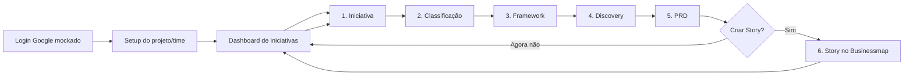

# Jornada do usuário — PM Builder

Persona principal: **Product Manager**. O MVP simula o login Google, gera o PRD
e permite criar uma Story no Businessmap como etapa final opcional.

## Visão da plataforma

### Login

O e-mail digitado representa a conta Google. Cada conta usa um workspace local
próprio e só enxerga o setup e as iniciativas cadastrados por ela.

Esse isolamento é uma demonstração de UX, não uma barreira de segurança. O SSO
real deverá validar sessão e autorização no backend.

### Setup geral do projeto/time

Antes da primeira iniciativa, o PM cadastra uma única vez:

- projeto/espaço do time e produto;
- PM, PD, TM, TL e time/squad;
- documentação geral de negócio por arquivo ou link do NotebookLM;
- repositórios públicos que formam o contexto técnico;
- opcionalmente, link do board e chave de API do Businessmap.

O setup pode ser editado no dashboard. Alterações passam a valer para todas as
iniciativas e deixam PRDs derivados como desatualizados.

### Dashboard de iniciativas

Lista apenas as iniciativas do usuário ativo. O PM pode criar uma nova ou
retomar um rascunho, discovery ou PRD anterior. Criar uma iniciativa não repete
o setup geral.

## Etapas de cada iniciativa

1. **Iniciativa:** nome, descrição da entrega, problema, público, resultado
   esperado, restrições e stakeholders.
2. **Classificação:** a skill sugere incremental ou novo fluxo; o PM confirma.
3. **Framework:** a skill recomenda um dos métodos disponíveis; o PM escolhe.
4. **Discovery:** os campos já recebem rascunhos baseados na dor e na entrega;
   o PM revisa e aprova.
5. **PRD:** gera o documento, permite edição e conversa no chat para responder
   perguntas ou pedir novas versões; depois aprova e exporta em DOC/Google Docs.
6. **Story no Businessmap (opcional):** mostra a prévia no template do time e
   cria o card sempre com o tipo `Story`, no workflow de cards e na coluna
   `Requested` do board configurado. O PM também pode pular e voltar depois.

## Regras transversais

- O autosave persiste o workspace por e-mail no `localStorage`.
- O setup geral é reutilizado; os dados da iniciativa, discovery e PRD ficam em
  registros independentes.
- A IA sugere; classificação, discovery e PRD mantêm gates humanos.
- Lacunas viram perguntas em aberto, não conteúdo inventado.
- Miro e NotebookLM entram como links; o conteúdo desses links não é lido.
- A chave do Businessmap fica no `localStorage` somente neste MVP. Em produção,
  precisa ser migrada para um cofre de segredos no backend.
